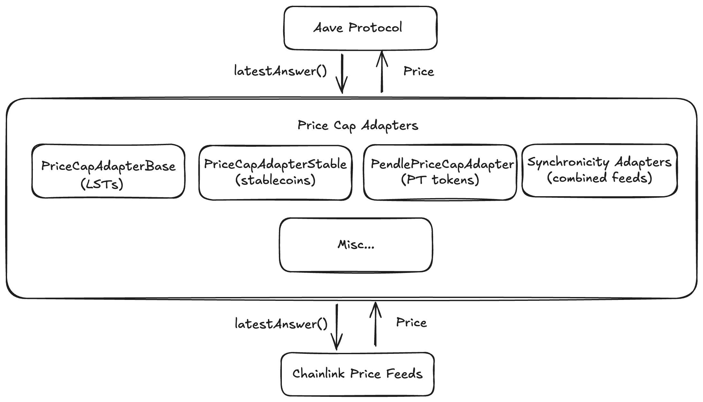

# Aave Price Feeds

Price oracle adapter smart contracts with upper-bound price protection for assets used by the Aave protocol.
These adapters wrap Chainlink price feeds and cap prices to prevent oracle manipulation or malfunction from affecting Aave pools.

## Overview

Aave protocol relies on external oracles for asset prices. If an oracle returns a negative, zero, or an abnormally high price
(due to bugs, manipulation, or errors), it could lead to protocol exploits. This repository provides protective wrappers that:

1. Fetches prices from Chainlink oracles
2. Validates prices against configured maximum bounds
3. Returns capped prices if bounds are exceeded



## Adapter Types

### RatioCapAdapter (LSTs)

For Liquid Staking Tokens (wstETH, rETH, weETH, etc.) that grow in value over time.

- Price capped based on maximum allowed yearly growth rate
- Uses snapshot ratio and timestamp as reference values to determine growth since then
- Returns capped ratio if current ratio exceeds calculated maximum

**Base contract:** [`PriceCapAdapterBase`](./src/contracts/PriceCapAdapterBase.sol)—see [detailed documentation](./src/contracts/README.md)

### FixCapAdapter (Stablecoins)

For USD-pegged stablecoins (USDC, USDT, DAI) with fixed 1:1 peg.

- Price capped at a single configured maximum value (e.g., $1.04 for 4% cap)
- Returns capped price if current price exceeds the fixed maximum

**Contract:** [`PriceCapAdapterStable`](./src/contracts/PriceCapAdapterStable.sol)

### Synchronicity Adapters

Combine two price feeds to derive a third pair.
- Does not cap the price derived from the feed's composition

| Adapter                                                                                            | Input Feeds         | Output    |
| -------------------------------------------------------------------------------------------------- | ------------------- | --------- |
| [`CLSynchronicityPriceAdapterBaseToPeg`](./src/contracts/CLSynchronicityPriceAdapterBaseToPeg.sol) | Asset/USD + ETH/USD | Asset/ETH |
| [`CLSynchronicityPriceAdapterPegToBase`](./src/contracts/CLSynchronicityPriceAdapterPegToBase.sol) | Asset/ETH + ETH/USD | Asset/USD |

### Specialized Adapters

| Adapter                                                                                | Purpose                                  |
| -------------------------------------------------------------------------------------- | ---------------------------------------- |
| [`PendlePriceCapAdapter`](./src/contracts/PendlePriceCapAdapter.sol)                   | PT tokens with linear discount decay     |
| [`CLRatePriceCapAdapter`](./src/contracts/CLRatePriceCapAdapter.sol)                   | Generic Chainlink rate-based cap         |
| [`DiscountedMKRSKYAdapter`](./src/contracts/misc-adapters/DiscountedMKRSKYAdapter.sol) | MKR price from SKY with dynamic discount |
| [`FixedPriceAdapter`](./src/contracts/misc-adapters/FixedPriceAdapter.sol)             | Hardcoded fixed price                    |

See [misc-adapters documentation](./src/contracts/misc-adapters/README.md) for details.

## Repository Structure

```text
├── src/
│   ├── contracts/                       # Core adapters
│   │   ├── lst-adapters/                # Asset-specific LST adapters (22 files)
│   │   └── misc-adapters/               # Specialized adapters
│   └── interfaces/
├── scripts/                             # Deployment scripts per network
├── tests/                               # Test suite per network
└── security/                            # Audit reports
```

## Development

> [!NOTE]
> The contracts in this repository use the Shanghai EVM version, please check network support before deploying.

```bash
# Install dependencies
forge install

# Run tests
forge test

# Run tests for specific network
forge test --match-path "tests/ethereum/*"
```

## Adding New Adapters

See [how-to.md](./how-to.md) for detailed instructions on adding LST or stablecoin adapters.

## Aave V4 Compatibility

The currently audited adapters expose only `latestAnswer()`, which is used by Aave v3 Oracle. Aave v4 Oracle uses `latestRoundData()` instead.

**For v4 compatibility:**

1. Add the `latestRoundData()` method to the `ICLSynchronicityPriceAdapter` interface: 
```solidity
  function latestRoundData()
    external
    view
    returns (
      uint80 roundId,
      int256 answer,
      uint256 startedAt,
      uint256 updatedAt,
      uint80 answeredInRound
    );

## Security

### Audits

- [SigmaPrime](./security/SigmaPrime/audit-report.md)
- [Certora CAPO](./security/Certora/CAPO%20report.pdf)
- [Certora Synchronicity](./security/Certora/CLSynchronicity%20Report.pdf)

## Related Documentation

- [Core Adapters Documentation](./src/contracts/README.md)—Detailed mechanics and formulas
- [Misc Adapters Reference](./src/contracts/misc-adapters/README.md)—Specialized adapters
- [How to Add New Adapters](./how-to.md)—Step-by-step guide

## Repository History

- The original contracts of this repository were developed inside the
  [CL Synchronicity Price Adapter](https://github.com/bgd-labs/cl-synchronicity-price-adapter) repository.
- They were later moved and improved in the [Aave Capo](https://github.com/bgd-labs/aave-capo) repository.
- The [Aave Capo](https://github.com/bgd-labs/aave-capo) repository was later renamed to
  [Aave Price Feeds](https://github.com/bgd-labs/aave-price-feeds) to better reflect its purpose.

## License

Copyright © 2026, Aave DAO, represented by its governance smart contracts.

Created by [BGD Labs](https://bgdlabs.com/).

The default license of this repository is [BUSL1.1](./LICENSE), but all interfaces are open source, MIT-licensed.

**IMPORTANT**. The BUSL1.1 license of this repository allows for any usage of the software,
if respecting the _Additional Use Grant_ limitations, forbidding any use case damaging anyhow the Aave DAO's interests.
